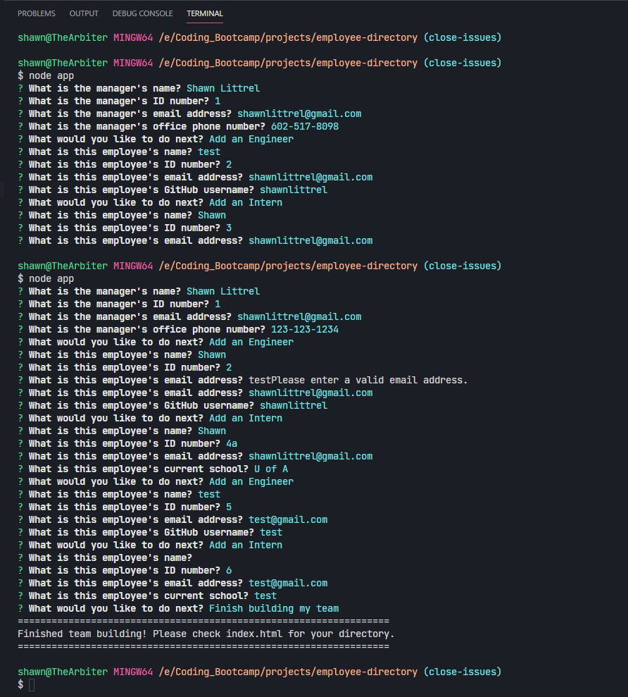
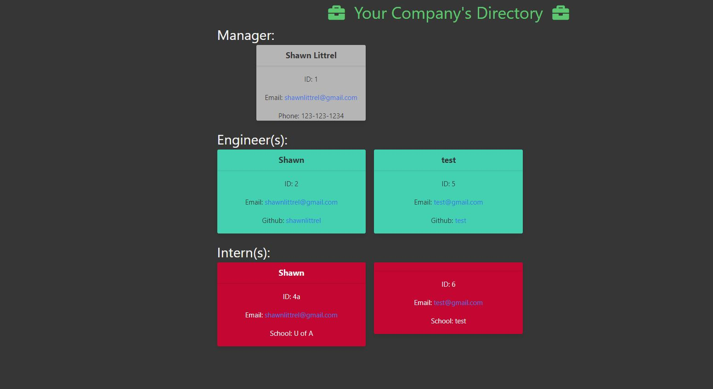

# Employee Directory
---
    
    
                  
---

    
## Table Of Contents
---
* [Installation](#installation)
* [Usage](#usage)
* [Licensing](#licensing)
* [Contribute To This Project](#contribute)
* [Questions and Contact Info](#questions-and-contact)

    
## Description
---
A command line interface that takes information of one manager, X engineers, and Y interns, then generates HTML code to be used in a webpage.  The employees can be entered in any order, and are automatically sorted by job title.
    

    
## Installation
---
The only required module is Inquirer, along with node.js.  After cloning the repo, simply type 'npm i' and then node app to start the prompts.

    
## Usage
---
node app begins the chain of prompts.  Input data, then manipulate the output 'index.html' as needed.

### Screenshots
---

Sample Input
---

---

Sample Output
---

---

    
    
## Licensing
---
Copyright 2021 Shawn Littrel 
    
    Permission is hereby granted, free of charge, to any person obtaining a copy of this software and associated documentation files (the "Software"), to deal in the Software without restriction, including without limitation the rights to use, copy, modify, merge, publish, distribute, sublicense, and/or sell copies of the Software, and to permit persons to whom the Software is furnished to do so, subject to the following conditions:  
        
    The above copyright notice and this permission notice shall be included in all copies or substantial portions of the Software. 
        
    THE SOFTWARE IS PROVIDED "AS IS", WITHOUT WARRANTY OF ANY KIND, EXPRESS OR IMPLIED, INCLUDING BUT NOT LIMITED TO THE WARRANTIES OF MERCHANTABILITY, FITNESS FOR A PARTICULAR PURPOSE AND NONINFRINGEMENT. IN NO EVENT SHALL THE AUTHORS OR COPYRIGHT HOLDERS BE LIABLE FOR ANY CLAIM, DAMAGES OR OTHER LIABILITY, WHETHER IN AN ACTION OF CONTRACT, TORT OR OTHERWISE, ARISING FROM, OUT OF OR IN CONNECTION WITH THE SOFTWARE OR THE USE OR OTHER DEALINGS IN THE SOFTWARE.

    
    
    
## Contribute
---
Want to contribute to this project?  Please make a pull request at www.github.com/shawnlittrel/employee-directory

    
## Questions And Contact
---
* Author: [Shawn Littrel](www.github.com/shawnlittrel)
* GitHub: (www.github.com/shawnlittrel/employee-directory)
* Email: shawnlittrel@gmail.com
    
    